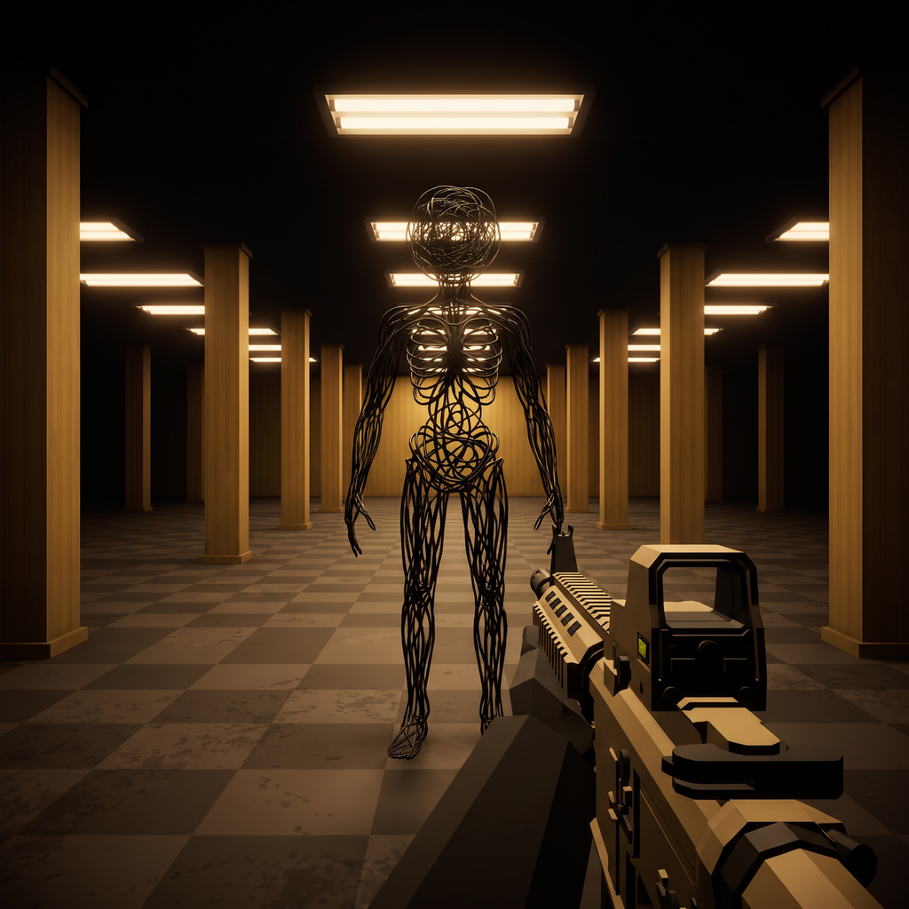

# Level0 · PICO VR



基于 Unity 和 PICO XR 的 Level0 第一人称射击游戏。`v1.2.4-vr-release`（Android versionCode **16**）包含本轮八项试玩反馈修改，并恢复使用游戏自身的原始图标。

[下载 APK / 查看 Releases](https://github.com/suanlaofan/fps-game-unity/releases) · [仓库](https://github.com/suanlaofan/fps-game-unity)

- 应用名称：**Level0**
- Android 包名：`com.suanlaofan.fpsgame.picofresh`
- Unity：**6000.5.4f1**
- 项目内嵌 PICO XR：**0.13.1**
- Android：ARM64、Vulkan，最低 API 29

## 本轮修改

| 试玩反馈 | 当前行为 |
|---|---|
| 开始、结束页面全屏，周围黑色 | 开始、胜利、失败及暂停页面按双眼共同视野等比适配，菜单外纯黑；进入游戏恢复地图。保留原页面比例，逐眼校验四角，并兼顾模拟器镜像裁切。 |
| 怪物开局太近 | 开始后提供 **8 秒**准备期；怪物选择至少 **18 米**外且导航可达的位置，并在实际出现前根据玩家新位置重新选择。已有测试中出现距离为 **22 米**。 |
| 手动换弹无响应 | 右 **B** 或右 **Grip** 触发手动换弹，显示 **1.8 秒**进度；满弹有提示，按住按键不会重复触发。 |
| 世界空间 UI 位置不合适 | 血量、弹药、怪物血量及准备、疾跑、换弹状态统一显示在面前的世界面板。面板随移动，转头超过 28° 并持续 0.5 秒后柔和回正。 |
| 恢复疾跑 | 步行 **2.0 m/s**、疾跑 **3.6 m/s**；按下左摇杆切换疾跑，或按住左 **X**。暂停、追踪丢失时清除疾跑状态。 |
| 去掉手臂、武器贴合手柄 | 只显示步枪和瞄具；真实扳机接触点对齐右手柄，换弹期间也不离手。枪口围绕扳机点下调 15°；保留完整枪身，正常握持时枪托可自然位于视野外，侧转检视可见。 |
| 怪物速度降低、血量翻倍 | 速度从 2.6 调为 **2.08 m/s**，血量从 150 调为 **300 HP**；普通命中伤害 15，完整普通命中 20 次击杀。 |
| 改善帧率 | 环境保留 **398 组**区域合批；四盏补光灯改为顶点光照，移除额外逐像素绘制；关闭实时阴影，武器使用静态网格，并联合烘焙引导场景与玩法场景的遮挡数据。 |

战斗面板使用独立的 **WorldSpace Canvas**，不挂在相机或手腕下。开始、结束和暂停菜单按本轮要求覆盖前方视野。结束页面中的枪械/手臂是原 Figma 背景插图，不是恢复了游戏手臂模型。

图标位于 `Assets/Level0VR/Branding/Level0Icon.png`，使用本游戏原始图像，不是通用 Unity/PICO 图标。原图 SHA256：`b34b624c198cad46ae68d901a2501ab5a1b8a24895ab3a4f88341fbd55e6ddf6`。

## 操作

| 操作 | PICO 手柄 | PICO 原生模拟器 |
|---|---|---|
| 移动 | 左摇杆 | WASD |
| 射击 / 点击菜单 | 右扳机 | U |
| 手动换弹 | 右 B 或右 Grip | **O**（Grip）；Forward Delete（B） |
| 切换疾跑 | 按下左摇杆 | R |
| 按住疾跑 | 左 X | X |
| 暂停 / 恢复 | 右 A | Space |
| 分段转向 | 右摇杆左右 | J / L |

模拟器需启用手柄模式并聚焦窗口。选择右手柄及 Interaction 工具后，移动鼠标调整射线，按下并松开 U 点击按钮。macOS 普通 Delete 通常是退格键，换弹优先用 O。Shift+WASD 用于平移当前手柄、Shift+Q/E 调整手柄高度；疾跑请用 R/X。Option+左键拖动用于相机环绕。不要将手柄移动到眼睛附近后，把该模拟姿态当成实体握持效果。

**Unity Editor 预览键位不同**：WASD 移动，Shift/X 按住疾跑，左 Ctrl 切换疾跑，U 射击，R/O 换弹，Q/E 转向，Esc 暂停。Android 使用原生 XR 输入，不走 Editor 键盘分支。

## 从源码构建

1. 安装 Unity **6000.5.4f1** 和 Android Build Support，包括 SDK、NDK、OpenJDK。
2. 克隆本仓库并等待 Unity 完成包解析。PICO XR 和 Unity MCP 以项目内嵌包提供，清单使用项目相对路径，不需要替换为某台电脑的绝对路径。
3. 关闭正在打开此项目的 Unity Editor，然后在仓库根目录运行完整构建入口。`UNITY_EDITOR` 应指向已安装版本的 Unity Editor 可执行文件：

```bash
mkdir -p Logs
"$UNITY_EDITOR" -batchmode -quit \
  -projectPath "$PWD" \
  -executeMethod PicoFreshBuild.ConfigureAndBuild \
  -logFile "$PWD/Logs/level0-build.log"
```

输出：

```text
Builds/PICO/Level0-PICO-VR-v1.2.4.apk
Builds/PICO/Level0-PICO-VR-build-receipt.txt
```

完整入口会依次配置 Android/图标/玩法场景、优化灯光、创建 `PicoFreshBootstrap`、联合烘焙遮挡、构建玩法 AssetBundle，再构建 APK。首次构建请使用 **`ConfigureAndBuild`**，不要只调用 `BuildApk`。

生成文件 `Assets/StreamingAssets/fpsgame-jogo-fresh.bundle` 及其清单不进入 Git；完整入口会自动重建。源网格、材质、脚本、Meta、导航和遮挡资源仍保留在仓库。运行时先启动轻量引导场景，再加载玩法 Bundle。

重新生成环境合批或引导场景后必须重新联合烘焙；只烘焙 `jogo`，或在烘焙后重建引导场景，会破坏共同遮挡引用。Unity MCP 的玩家循环上下文不能直接执行 `BuildPlayer`，实际打包使用上述原生批处理入口。

## 验证范围

本轮玩法证据来自 `v1.2.3/code15`；`v1.2.4/code16` 为同一整改工作的图标与发布版本。

- Editor 已验证菜单与游戏结构、正常输入循环中的射击和部分弹匣换弹、疾跑、准备期与动态出生、HUD 回正、暂停与结束边界；正常握持及侧转检视完整枪身也有实际画面验证。
- PICO 原生模拟器已验证菜单/胜利/失败页面、扳机进入游戏、8 秒准备、22 米怪物出生和疾跑切换。**原生 B/Grip 的“部分弹匣→换弹进度→24 发”完整过程尚未确认**，不能用 Editor 验证替代。
- 模拟器两段连续游戏采样约 **60 FPS**，合计约 **40 秒**；各约 5 秒窗口的 P95 为 **18.15–19.87 ms**。完整 144 个记录窗口仍有 **34 个低于 5 FPS**、最低 **1.85 FPS**。曾观察到宿主窗口置前后恢复，但并无覆盖所有低帧区间的宿主状态时间戳，因此原因尚未全部确认，**不声称全程流畅**。Android 的 `focused=1` 不能单独证明宿主模拟器窗口始终处于前台。
- 真实头显的实体握持、双眼舒适性、B/Grip 换弹、完整战斗及 20 分钟热稳定性能仍待验证。模拟器与 Editor 结果不等于真机验收。

本次 **v1.2.4/code16** 已通过 Unity 原生构建、ARM64/v2签名/16KiB对齐/ZIP/内置Bundle一致性验证。APK中6档密度共24张图标PNG及自适应XML引用核对通过，原图没有替换或加白边。模拟器安装的base.apk摘要与发布包一致，XR会话及jogo加载完成；本次未重复完整战斗验收。

APK SHA256：`cc699d1d4110f4997d94f4dd0172d0e86c4433b2132a46b7474d3fc2e9c6f272`，大小208,127,958 bytes。图标与安装证据见 `Evidence/v1.2.4/`。
